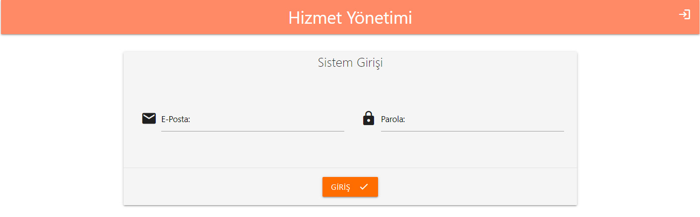
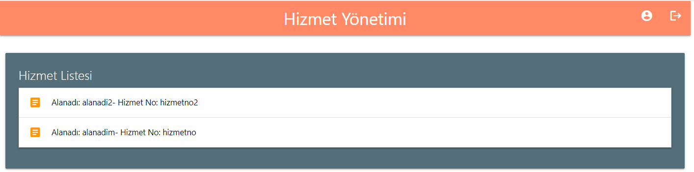
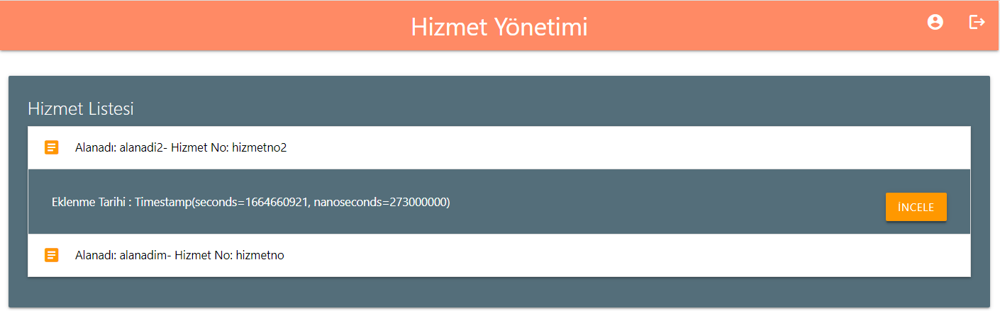
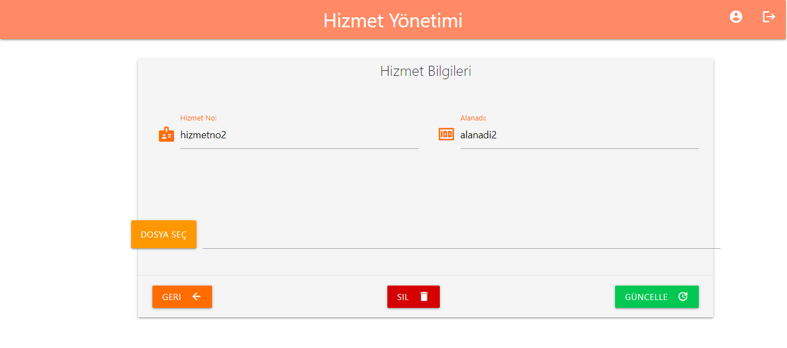

# hizmet-yonetimi-app

### giris-bilgileri 
#### e-posta: hizmetyonetimi@gmail.com 
#### sifre: 123456789











<<<<<<< HEAD
=======

## Project setup
```
npm install
```

### Compiles and hot-reloads for development
```
npm run serve
```

### Compiles and minifies for production
```
npm run build
```

### Customize configuration
See [Configuration Reference](https://cli.vuejs.org/config/).
>>>>>>> d41ec18d374859632d432b3614d5ca0ea4eb4c78

## Project setup
```
npm install
```

### Compiles and hot-reloads for development
```
npm run serve
```

### Compiles and minifies for production
```
npm run build
```

### Customize configuration
See [Configuration Reference](https://cli.vuejs.org/config/).
